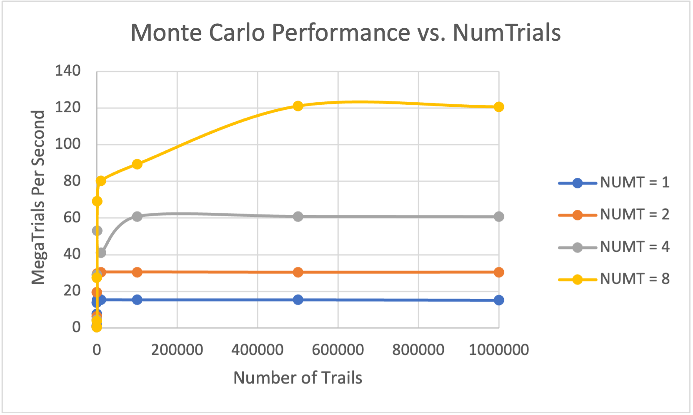

# 1. Tables and Graphs

## Table

| NUMT | NUMTRIAL | PROBABILITY | MAXPERFORMANCE |
| :--- | :------- | :---------- | :------------- |
| 1    | 1        | 0.00%       | 1.31           |
| 1    | 10       | 10.00%      | 7.59           |
| 1    | 100      | 29.00%      | 13.89          |
| 1    | 1000     | 31.70%      | 15.34          |
| 1    | 10000    | 29.24%      | 15.43          |
| 1    | 100000   | 29.37%      | 15.34          |
| 1    | 500000   | 29.13%      | 15.34          |
| 1    | 1000000  | 29.14%      | 15.1           |
| 2    | 1        | 0.00%       | 0.52           |
| 2    | 10       | 10.00%      | 6.23           |
| 2    | 100      | 21.00%      | 19.36          |
| 2    | 1000     | 27.90%      | 29.58          |
| 2    | 10000    | 29.26%      | 30.41          |
| 2    | 100000   | 28.96%      | 30.47          |
| 2    | 500000   | 29.15%      | 30.27          |
| 2    | 1000000  | 29.10%      | 30.34          |
| 4    | 1        | 0.00%       | 0.47           |
| 4    | 10       | 30.00%      | 4.42           |
| 4    | 100      | 35.00%      | 28.91          |
| 4    | 1000     | 28.70%      | 53.15          |
| 4    | 10000    | 28.87%      | 41.01          |
| 4    | 100000   | 29.06%      | 60.83          |
| 4    | 500000   | 29.02%      | 60.85          |
| 4    | 1000000  | 29.10%      | 60.7           |
| 8    | 1        | 0.00%       | 0.38           |
| 8    | 10       | 30.00%      | 3.83           |
| 8    | 100      | 25.00%      | 27.36          |
| 8    | 1000     | 29.30%      | 69.09          |
| 8    | 10000    | 29.10%      | 80.3           |
| 8    | 100000   | 28.89%      | 89.46          |
| 8    | 500000   | 28.94%      | 121.2          |
| 8    | 1000000  | 29.02%      | 120.74         |

Table: DATA COLLECTION

Then make a Pivot table for visualization, the row label is NUMTRIALS and the column label is NUMTS.

|     | 1    | 10   | 100   | 1000  | 10000 | 100000 | 500000 | 1000000 |
| :-- | :--- | :--- | :---- | :---- | :---- | :----- | :----- | :------ |
| 1   | 1.31 | 7.59 | 13.89 | 15.34 | 15.43 | 15.34  | 15.34  | 15.1    |
| 2   | 0.52 | 6.23 | 19.36 | 29.58 | 30.41 | 30.47  | 30.27  | 30.34   |
| 4   | 0.47 | 4.42 | 28.91 | 53.15 | 41.01 | 60.83  | 60.85  | 60.7    |
| 8   | 0.38 | 3.83 | 27.36 | 69.09 | 80.3  | 89.46  | 121.2  | 120.74  |

Table: PIVOT TABLE

## Graphs

I ran this Monte Carlo simulation on flip3.

# 2. Actual Probability

I choose the one with maximum number of trials to get the actual probability. As it can be seen in Table 1, the actual probability is about $29.1%$. Since in Monte Carlo simulation, with the number of trails increasing, the probability will be more reliable and close to the true probability.

# 3. Parallel Fraction Computation

According to Amdahl's Law:

$$S = \frac{P_n}{P_1} = \frac{1}{\frac{F_p}{n}+(1-F_p)}$$

Solving for F:

$$F = \frac{n}{(n-1)}(1-\frac{1}{S}) = \frac{n}{(n-1)}\frac{P_n-P_1}{P_n}$$

Where $P_1$ and $P_n$ stand for Performance.

Using number of trails equaling to 100000 to calculate the parallel fraction as a example.

$$F_{p,2} = \frac{n}{(n-1)}\frac{P_n-P_1}{P_n} = \frac{2}{(2-1)}\frac{30.47-15.34}{30.34}=0.99736$$

$$F_{p,4} = \frac{n}{(n-1)}\frac{P_n-P_1}{P_n} = \frac{4}{(4-1)}\frac{60.83-15.34}{60.83}=0.99710$$

$$F_{p,8} = \frac{n}{(n-1)}\frac{P_n-P_1}{P_n} = \frac{8}{(8-1)}\frac{89.46-15.34}{89.46}=0.94689$$

$$\bar{F_p}=\frac{\sum_{i=2}^N F_{p,i}}{N-1} = \frac{0.99736+0.99710+0.94689}{3}=0.98045$$

And do calculations for all number of trials in Excel.

| NumTrails | Parallel Fraction |
| :-------- | :---------------- |
| 100       | 0.606821278       |
| 1000      | 0.933477553       |
| 10000     | 0.9133738         |
| 100000    | 0.979030461       |
| 500000    | 0.993956624       |
| 1000000   | 1.002063609       |
| Average   | 0.904787221       |

Table: Parallel Fraction Computation

So, the average parallel fraction is 0.9048.