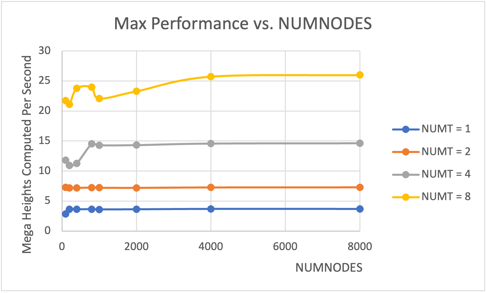
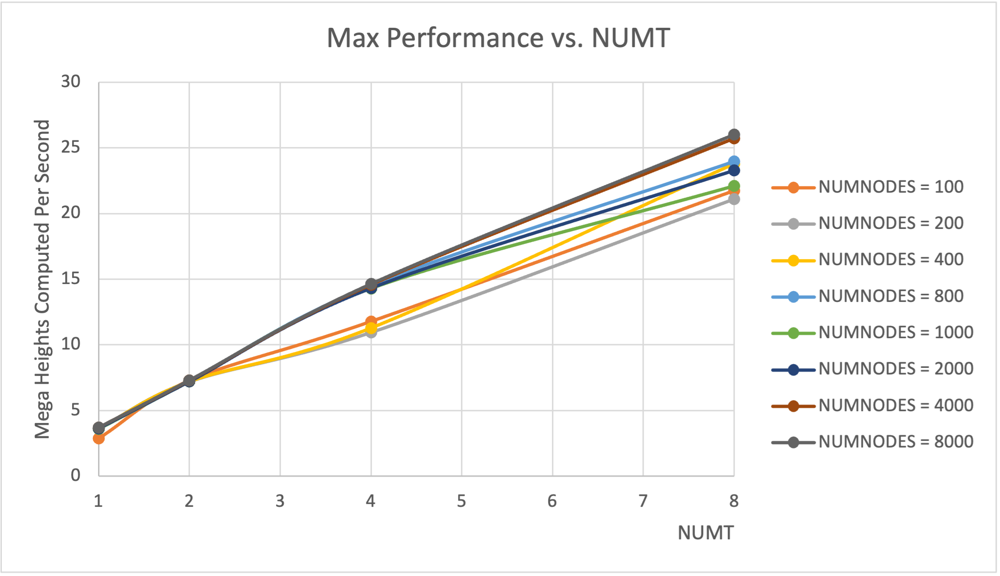

## 1. Tell what machine you ran this on.

I ran this project on flip3.

## 2. What do you think the actual volume is?

I think the actual volume is 7.76.

## 3. Show the performances you achieved in tables and two graphs showing:
1. Performance as a function of NUMNODES with colored lines showing different NUMT values
2. Performance as a function of NUMT with colored lines showing different NUMNODES values

### Tables

| NUMT | NUMNODES | VOLUME | MAXPERFORMANCE |
| :--- | :------- | :----- | :------------- |
| 1    | 100      | 7.76   | 2.88           |
| 1    | 200      | 7.76   | 3.65           |
| 1    | 400      | 7.76   | 3.63           |
| 1    | 800      | 7.76   | 3.65           |
| 1    | 1000     | 7.76   | 3.61           |
| 1    | 2000     | 7.8    | 3.63           |
| 1    | 4000     | 7.46   | 3.69           |
| 1    | 8000     | 4      | 3.69           |
| 2    | 100      | 7.76   | 7.29           |
| 2    | 200      | 7.76   | 7.21           |
| 2    | 400      | 7.76   | 7.21           |
| 2    | 800      | 7.76   | 7.25           |
| 2    | 1000     | 7.76   | 7.22           |
| 2    | 2000     | 7.77   | 7.21           |
| 2    | 4000     | 7.61   | 7.28           |
| 2    | 8000     | 7.63   | 7.3            |
| 4    | 100      | 7.76   | 11.79          |
| 4    | 200      | 7.76   | 10.96          |
| 4    | 400      | 7.76   | 11.29          |
| 4    | 800      | 7.76   | 14.53          |
| 4    | 1000     | 7.76   | 14.3           |
| 4    | 2000     | 7.76   | 14.32          |
| 4    | 4000     | 7.78   | 14.58          |
| 4    | 8000     | 7.44   | 14.63          |
| 8    | 100      | 7.76   | 21.75          |
| 8    | 200      | 7.76   | 21.11          |
| 8    | 400      | 7.76   | 23.8           |
| 8    | 800      | 7.76   | 23.97          |
| 8    | 1000     | 7.76   | 22.09          |
| 8    | 2000     | 7.76   | 23.29          |
| 8    | 4000     | 7.77   | 25.74          |
| 8    | 8000     | 7.56   | 26             |

Table: Data Collection

And a pivot table for plotting.

|            | 1    | 2    | 4     | 8     |
| :--------- | :--- | :--- | :---- | :---- |
| 100        | 2.88 | 7.29 | 11.79 | 21.75 |
| 200        | 3.65 | 7.21 | 10.96 | 21.11 |
| 400        | 3.63 | 7.21 | 11.29 | 23.8  |
| 800        | 3.65 | 7.25 | 14.53 | 23.97 |
| 1000       | 3.61 | 7.22 | 14.3  | 22.09 |
| 2000       | 3.63 | 7.21 | 14.32 | 23.29 |
| 4000       | 3.69 | 7.28 | 14.58 | 25.74 |
| 8000       | 3.69 | 7.3  | 14.63 | 26    |

Table: Pivot Table

### Graphs

Use the pivot table above to plot.

All plots are generated by using Microsoft Excel.

## 4. What patterns are you seeing in the speeds?

As can be seen from Figure 1, the speeds has a gradually increasing inclination and eventually reaches a stable state. From Figure 2, it can be seen that the performance increases as the number of threads increases.

## 5. Why do you think it is behaving this way?

Because we use parallel computing inside our project, which divide this project into multiple threads. And that will improve the performance of computing. 

Also, according to Gustafson-Baris Observation, when using the same parallel program on larger datasets -- in our case, increasing the NUMNODES, the parallel fraction $F_p$ increase. So, the performance for big NUMNODES will be better compared to small NUMNODES.

## 6. What is the Parallel Fraction for this application, using the Inverse Amdahl equation?

$$F = \frac{n}{(n-1)}(1-\frac{1}{S}) = \frac{n}{(n-1)}\frac{P_n-P_1}{P_n}$$

use the data when $\text{NUMNODES} = 8000$.

$$F_{p,2} = \frac{n}{(n-1)}\frac{P_n-P_1}{P_n} = \frac{2}{(2-1)}\frac{7.3-3.69}{7.3}=0.989$$

$$F_{p,4} = \frac{n}{(n-1)}\frac{P_n-P_1}{P_n} = \frac{4}{(4-1)}\frac{14.63-3.69}{14.63}=0.997$$

$$F_{p,8} = \frac{n}{(n-1)}\frac{P_n-P_1}{P_n} = \frac{8}{(8-1)}\frac{26-3.69}{26}=0.981$$

$$\bar{F_p}=\frac{\sum_{i=2}^N F_{p,i}}{N-1} = \frac{0.989+0.997+0.981}{3}=0.989$$

So, the parallel fraction for this application is $0.989$.

## 7. Given that Parallel Fraction, what is the maximum speed-up you could ever get?

$$
\max Speedup = \lim_{n \rightarrow \infty}Speedup = \frac{1}{1-F_p}=\frac{1}{1-0.989}=90.9
$$

The maximum speed-up I could get in this case is 90.9