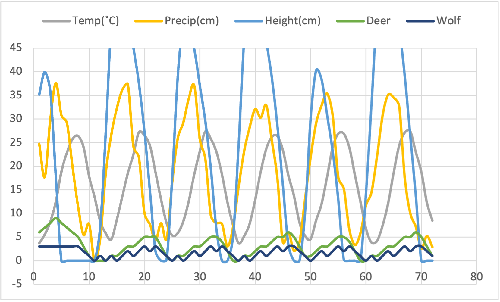

# 1. What your own-choice quantity was and how it fits into the simulation.

I have chosen wolf as my own-choice quantity, as wolf is a kind of nature enemy of deer. So, it will affect the trend of deer population. I assume that when the number of wolves is less than one-tenth the number of deer, the wolves have enough food and thus increase the number of wolves. When the number of wolves is between one-tenth to two-fifths of the deer population, the wolf's insufficient hunting ability leads to insufficient food and the number of wolves decreases. When the number of wolves is two-fifth to one-half of the number of deer, this is the most suitable ratio. At this time, the wolves have enough fighting strength to obtain food and sufficient food will increase the number of wolves. When the number of wolves exceeds half the number of deer, the number of wolves decreases due to insufficient food. At the same time, the number of deer will also be affected by the number of wolves. When the number of wolves is greater than two-fifths of the number of deer, the number of deer will decrease according to the current number of wolves. In addition, to control the number of wolves, there may be some hunter killing wolves to keep them away from villages, so when the number of wolves is larger than 3, the number of wolves will decrease by one.

# 2. A table showing values for temperature, precipitation, number of deer, height of the grain, and your own-choice quantity as a function of month number.

|Year| Month|Precip(cm)|Temp($^{\circ}C$)|Height of Grain(cm)|Deer|Wolf|
| :--- | :-- | :---- | :---- | :---- | :-- | :-- |
| 2022 | 1   | 3.71  | 24.77 | 35.15 | 6   | 3   |
| 2022 | 2   | 5.57  | 17.73 | 39.95 | 7   | 3   |
| 2022 | 3   | 8.28  | 29.92 | 35.9  | 8   | 3   |
| 2022 | 4   | 12.52 | 37.58 | 17.78 | 9   | 3   |
| 2022 | 5   | 18.81 | 30.82 | 0     | 8   | 3   |
| 2022 | 6   | 22.86 | 29.16 | 0     | 7   | 3   |
| 2022 | 7   | 25.72 | 20.05 | 0     | 6   | 3   |
| 2022 | 8   | 26.39 | 11.58 | 0     | 5   | 3   |
| 2022 | 9   | 24.05 | 5.48  | 0     | 3   | 2   |
| 2022 | 10  | 17.9  | 7.78  | 0     | 1   | 1   |
| 2022 | 11  | 13.48 | 0     | 0     | 0   | 0   |
| 2022 | 12  | 8.42  | 4.51  | 6.98  | 0   | 1   |
| 2023 | 1   | 5.85  | 18.39 | 26.84 | 0   | 0   |
| 2023 | 2   | 4.52  | 26.59 | 49.65 | 1   | 1   |
| 2023 | 3   | 8.65  | 32.21 | 59.1  | 1   | 0   |
| 2023 | 4   | 13.6  | 36.19 | 57.82 | 2   | 1   |
| 2023 | 5   | 18.53 | 37.31 | 52.77 | 3   | 2   |
| 2023 | 6   | 22.43 | 24.27 | 45.15 | 3   | 1   |
| 2023 | 7   | 27.16 | 21.82 | 37.53 | 4   | 2   |
| 2023 | 8   | 26.51 | 10.13 | 27.37 | 5   | 3   |
| 2023 | 9   | 24.31 | 7.71  | 14.67 | 5   | 2   |
| 2023 | 10  | 18.72 | 4.27  | 1.99  | 5   | 3   |
| 2023 | 11  | 12.97 | 7.97  | 0     | 3   | 2   |
| 2023 | 12  | 7.97  | 4.64  | 0.22  | 1   | 1   |
| 2024 | 1   | 5.37  | 16.35 | 17.26 | 0   | 0   |
| 2024 | 2   | 5.86  | 25.79 | 38.68 | 1   | 1   |
| 2024 | 3   | 8.28  | 29.18 | 50.01 | 1   | 0   |
| 2024 | 4   | 12.63 | 34.32 | 49.77 | 2   | 1   |
| 2024 | 5   | 18.31 | 37.04 | 44.73 | 3   | 2   |
| 2024 | 6   | 23.15 | 25.77 | 37.11 | 3   | 1   |
| 2024 | 7   | 27.35 | 21.52 | 29.49 | 4   | 2   |
| 2024 | 8   | 25.74 | 9.52  | 19.33 | 5   | 3   |
| 2024 | 9   | 23.03 | 7.98  | 6.63  | 5   | 2   |
| 2024 | 10  | 18.27 | 7.84  | 0     | 4   | 3   |
| 2024 | 11  | 12.31 | 3.07  | 0     | 2   | 2   |
| 2024 | 12  | 7.49  | 7.13  | 5.02  | 0   | 1   |
| 2025 | 1   | 3.73  | 15.63 | 24.42 | 0   | 0   |
| 2025 | 2   | 5.24  | 23.15 | 46.64 | 1   | 1   |
| 2025 | 3   | 7.87  | 28.23 | 59.55 | 1   | 0   |
| 2025 | 4   | 12.91 | 32.1  | 59.1  | 2   | 1   |
| 2025 | 5   | 18.86 | 30.3  | 54.05 | 3   | 2   |
| 2025 | 6   | 23.65 | 32.92 | 46.43 | 3   | 1   |
| 2025 | 7   | 26.16 | 25.49 | 38.81 | 4   | 2   |
| 2025 | 8   | 26.36 | 17.51 | 28.65 | 5   | 3   |
| 2025 | 9   | 23.38 | 3.9   | 15.95 | 5   | 2   |
| 2025 | 10  | 18.01 | 6.05  | 3.28  | 6   | 3   |
| 2025 | 11  | 13.76 | 2.13  | 0     | 5   | 3   |
| 2025 | 12  | 8.13  | 3.91  | 0     | 3   | 2   |
| 2026 | 1   | 5.3   | 13.04 | 9.99  | 1   | 1   |
| 2026 | 2   | 4.59  | 21.8  | 29.84 | 1   | 0   |
| 2026 | 3   | 8.56  | 29.09 | 40.23 | 2   | 1   |
| 2026 | 4   | 12.1  | 32.92 | 38.29 | 3   | 2   |
| 2026 | 5   | 17.84 | 35.38 | 30.73 | 3   | 1   |
| 2026 | 6   | 23.98 | 30.78 | 23.11 | 4   | 2   |
| 2026 | 7   | 26.85 | 17.72 | 12.95 | 5   | 3   |
| 2026 | 8   | 26.86 | 15.29 | 0.25  | 5   | 2   |
| 2026 | 9   | 23.94 | 6.62  | 0     | 4   | 3   |
| 2026 | 10  | 18.19 | 3.34  | 0     | 2   | 2   |
| 2026 | 11  | 12.56 | 5.83  | 0     | 0   | 1   |
| 2026 | 12  | 6.85  | 11.72 | 14.17 | 0   | 0   |
| 2027 | 1   | 3.88  | 14.53 | 33.01 | 1   | 1   |
| 2027 | 2   | 4.22  | 22.07 | 52.9  | 1   | 0   |
| 2027 | 3   | 7.43  | 30.69 | 66.74 | 2   | 1   |
| 2027 | 4   | 12.14 | 35.14 | 64.56 | 3   | 2   |
| 2027 | 5   | 18.58 | 34.56 | 56.97 | 3   | 1   |
| 2027 | 6   | 24.34 | 32.71 | 49.35 | 4   | 2   |
| 2027 | 7   | 27.08 | 17.69 | 39.19 | 5   | 3   |
| 2027 | 8   | 27.38 | 10.1  | 26.49 | 5   | 2   |
| 2027 | 9   | 22.98 | 7.2   | 13.79 | 6   | 3   |
| 2027 | 10  | 18.8  | 2.6   | 0     | 5   | 3   |
| 2027 | 11  | 12.33 | 5.24  | 0     | 3   | 2   |
| 2027 | 12  | 8.5   | 2.92  | 0     | 1   | 1   |

Table: Data Collection

# 3. A graph showing temperature, precipitation, number of deer, height of the grain, and your own-choice quantity as a function of month number.

# 4. A commentary about the patterns in the graph and why they turned out that way. What evidence in the curves proves that your own quantity is actually affecting the simulation correctly?

My expectation for this pattern is a coexistence-predation relationship of the three organisms, with some human intervention added. When the grain is plentiful, the deer population will grow gradually, while the wolves will grow and then stabilize because I assume hunters will control their numbers. When the deer population is large enough, the grain is not enough to satisfy the deer population and the deer population continues to grow, resulting in a decrease in the deer population. At this time, the food of the wolves will also be reduced, resulting in a decrease in the number of wolves. Continued reductions in grain led to the disappearance of deer populations and the disappearance of wolves due to lack of food. When the weather condition improves and grains start growing, new deer migrate. With enough deer for food, wolves also migrate here. Subsequently, the grain will be in such a fluctuating state, and the number of deer is inversely related to the height of the grain. In my hypothesis, the predation ability of wolves is limited, and when the number of wolves is more than half of the number of deer, the number of new births of deer will be less than death, and the number of deer will decrease at this time. And when there are enough deer, it will indeed lead to the same increase in the number of wolves, but due to human control, the number of wolves will not exceed the critical number of 3, and the number of deer will not be completely affected by the increase in the number of wolves.

To show the evidence of above statements, we can see the trend from the whole year of 2025.

|Year| Month|Precip(cm)|Temp($^{\circ}C$)|Height of Grain(cm)|Deer|Wolf|
| :--- | :-- | :---- | :---- | :---- | :-- | :-- |
| 2025 | 1   | 3.73  | 15.63 | 24.42 | 0   | 0   |
| 2025 | 2   | 5.24  | 23.15 | 46.64 | 1   | 1   |
| 2025 | 3   | 7.87  | 28.23 | 59.55 | 1   | 0   |
| 2025 | 4   | 12.91 | 32.1  | 59.1  | 2   | 1   |
| 2025 | 5   | 18.86 | 30.3  | 54.05 | 3   | 2   |
| 2025 | 6   | 23.65 | 32.92 | 46.43 | 3   | 1   |
| 2025 | 7   | 26.16 | 25.49 | 38.81 | 4   | 2   |
| 2025 | 8   | 26.36 | 17.51 | 28.65 | 5   | 3   |
| 2025 | 9   | 23.38 | 3.9   | 15.95 | 5   | 2   |
| 2025 | 10  | 18.01 | 6.05  | 3.28  | 6   | 3   |
| 2025 | 11  | 13.76 | 2.13  | 0     | 5   | 3   |
| 2025 | 12  | 8.13  | 3.91  | 0     | 3   | 2   |

Table: Trend in the Whole Year of 2025

As the grain increase, the number of deer begin to increase gradually. At the same time, number of wolves begin to increase, which affects the increasing speed of deer population, and in response to the lack of food caused by the insufficient number of deer, the number of wolves will decrease again. But thanks to the growing of grain, in general, the number of deer still increase, which leads to increasing on number of wolves. And the number of wolves will never exceed to 3. Then the height of grain begin to decrease, leading to decrease of both number of deer and wolves.