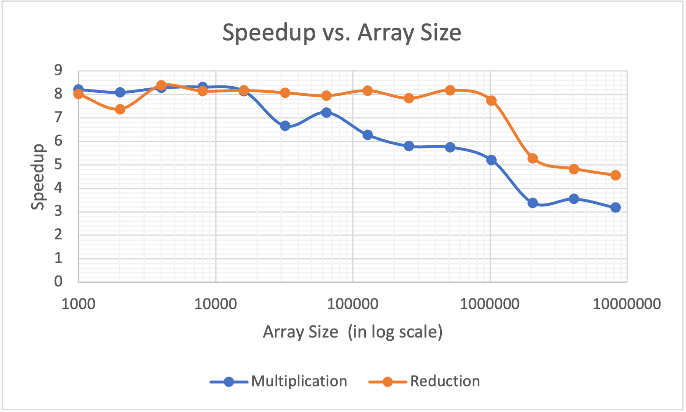

# 1. What machine you ran this on?

I ran this project on flip 1.

# 2. Show the table of performances for each array size and the corresponding speedups.

| ARRAY SIZE | Multiplication Speedup | Reduction Speedup |
| :-------- | :--------------------- | :---------------- |
| 1000      | 8.21                   | 8.02              |
| 2000      | 8.09                   | 7.38              |
| 4000      | 8.28                   | 8.39              |
| 8000      | 8.32                   | 8.15              |
| 16000     | 8.15                   | 8.18              |
| 32000     | 6.66                   | 8.08              |
| 64000     | 7.24                   | 7.95              |
| 128000    | 6.28                   | 8.17              |
| 256000    | 5.8                    | 7.84              |
| 512000    | 5.76                   | 8.19              |
| 1024000   | 5.21                   | 7.75              |
| 2048000   | 3.38                   | 5.28              |
| 4096000   | 3.55                   | 4.83              |
| 8192000   | 3.18                   | 4.55              |

Table: Performance for each array size and the corresponding speedups

# 3. Show the graph of SIMD/non-SIMD speedup versus array size.

# 4. What patterns are you seeing in the speedups?

From this graph we can see that as the array size grows, the general trend of speedup is decreasing, although there are some growing trends in the middle.

# 5. Are they consistent across a variety of array sizes?

In terms of speedup, they are not consistent with different array sizes. But from the trend point of view, the speedups show a relatively consistent downward trend as the array size increases.

# 6. Why or why not, do you think?

This is because the memory transfer cannot keep up. The SIMD is fast enough so at small array size, the cash line is enough for speeding up. But when the array size becomes bigger, the next cash line will become late but we need bigger amount of cash line so that results in a speedup decreasing. And a way to solve this speedup decreasing is using prefetching, which can place a cash line in memory before it is to be used.