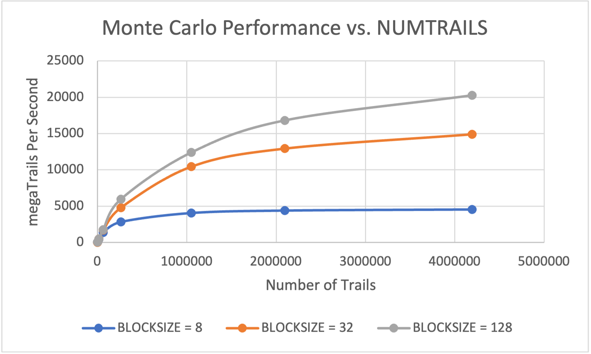
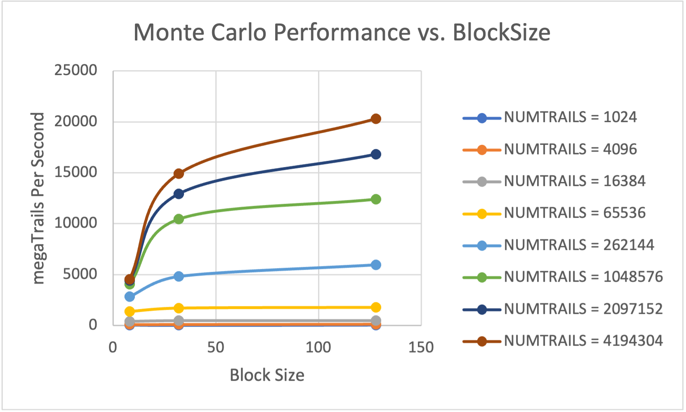

# 1. Tell what machine you ran this on.

I ran this program on DGX system.

# 2. Show the table and the two graphs.

## Tables

| NUMTRAILS | BLOCKSIZE | megaTrailsPerSecond | probability |
| :-------- | :-------- | :------------------ | :---------- |
| 1024      | 8         | 29.4118             | 21.39%      |
| 1024      | 32        | 28.5714             | 22.56%      |
| 1024      | 128       | 29.4118             | 20.41%      |
| 4096      | 8         | 114.2857            | 21.78%      |
| 4096      | 32        | 117.6471            | 22.66%      |
| 4096      | 128       | 125                 | 22.36%      |
| 16384     | 8         | 421.0527            | 22.47%      |
| 16384     | 32        | 484.8485            | 22.73%      |
| 16384     | 128       | 484.8485            | 23.14%      |
| 65536     | 8         | 1386.5945           | 22.27%      |
| 65536     | 32        | 1696.7689           | 22.36%      |
| 65536     | 128       | 1765.5173           | 22.60%      |
| 262144    | 8         | 2823.8539           | 22.41%      |
| 262144    | 32        | 4804.6922           | 22.49%      |
| 262144    | 128       | 5949.1648           | 22.54%      |
| 1048576   | 8         | 4059.9679           | 22.46%      |
| 1048576   | 32        | 10445.649           | 22.49%      |
| 1048576   | 128       | 12393.3429          | 22.51%      |
| 2097152   | 8         | 4402.5258           | 22.51%      |
| 2097152   | 32        | 12946.6617          | 22.49%      |
| 2097152   | 128       | 16834.3177          | 22.52%      |
| 4194304   | 8         | 4553.9572           | 22.49%      |
| 4194304   | 32        | 14916.582           | 22.52%      |
| 4194304   | 128       | 20299.21            | 22.47%      |

Table: Simulation Result

|         | 8         | 32         | 128        |
| :------ | :-------- | :--------- | :--------- |
| 1024    | 29.4118   | 28.5714    | 29.4118    |
| 4096    | 114.2857  | 117.6471   | 125        |
| 16384   | 421.0527  | 484.8485   | 484.8485   |
| 65536   | 1386.5945 | 1696.7689  | 1765.5173  |
| 262144  | 2823.8539 | 4804.6922  | 5949.1648  |
| 1048576 | 4059.9679 | 10445.649  | 12393.3429 |
| 2097152 | 4402.5258 | 12946.6617 | 16834.3177 |
| 4194304 | 4553.9572 | 14916.582  | 20299.21   |

Table: Pivot Table

## Graphs

# 3. What patterns are you seeing in the performance curves?

When the number of trials increases, the performance also increases. The performance increases rapidly at lower number of trails. When the number of trial reaches large enough, then the increasing speed change to be stable and close to zero. From the figure "Performance vs. BlockSize", it is obvious that with the block size increasing, the performance will increase. However, when the number of trials is small, the speed shows very low. And, when the number of trials is so small like 1k, 4k, 16k, there is no change to the performance when the block size increase.

# 4. Why do you think the patterns look this way?

In the graph of Performance vs. NumTrials, As the data size increases, the scheduler must schedule more and more blocks for each processor. Since the block size remains the same, when we increase the size of the data set, the scheduler will do more work. Due to the increased workload of the scheduler and SM. Intuitive calculations will take more time, and the speed of performance improvement will also decrease. Then it will be solved by increasing the block size. In the graph of Performance vs. BLOCKSIZE, Parallel computing can improve efficiency, so when the data is large, the graph changes will be obvious.

# 5. Why is a BLOCKSIZE of 8 so much worse than the others?

Compared to the other two block sizes, the 8-thread block size clearly lacks performance. I think this is because the block size is less than 32. When it has 8 block sizes, the remaining threads will not be fully utilized. Since the other two blocks are multiples of 32, they can be run with full utilization, maximizing efficiency.

# 6. How do these performance results compare with what you got in Project #1? Why?

By comparing with "Performance vs. Thread" in Project 1, the Project 5 is indeed much greater than the performance of Project 1. This is because number of CPU threads is relatively small compared to GPU.

# 7. What does this mean for the proper use of GPU parallel computing?

The most obvious use of GPU parallel computing is maximized performance. And the larger the size of data, the better the performance. Because threads can be fully utilized without being idle. Second, the data selection uses a multiple of 32, so that each block size gets a complete queue at a time. We should also consider limiting the block size. When the block size reaches a certain maximum, performance does not improve.