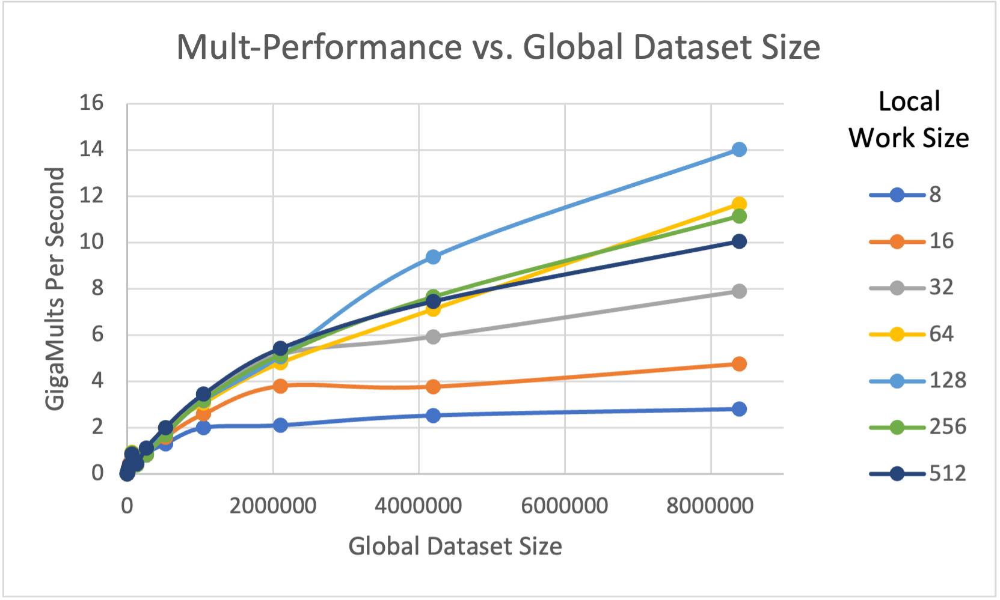
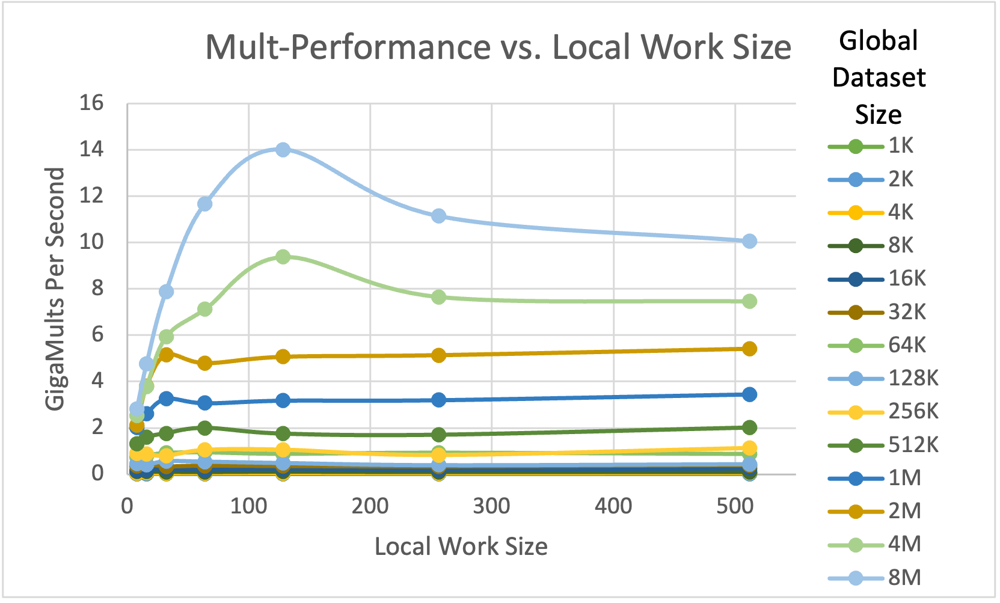
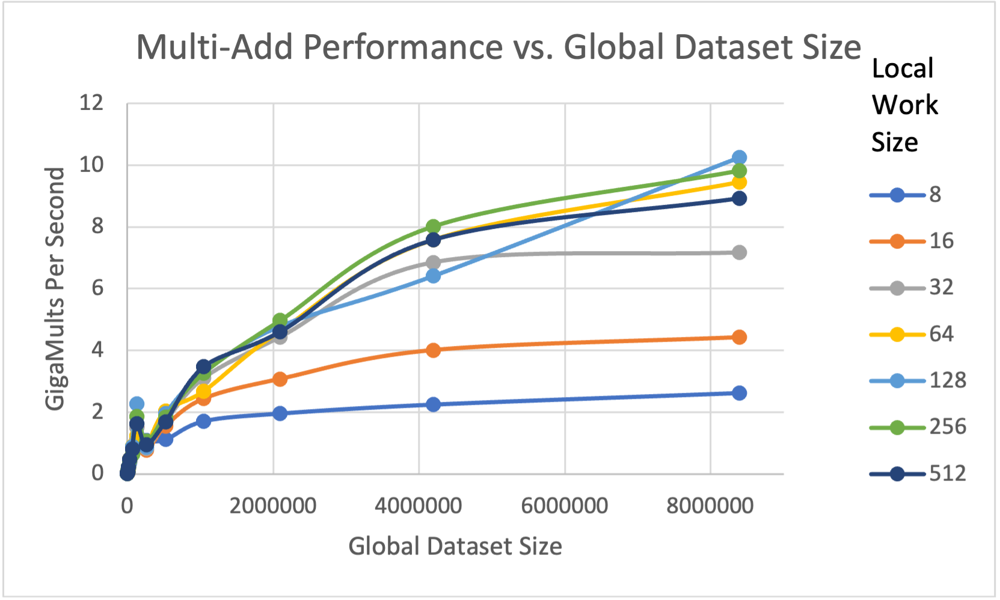
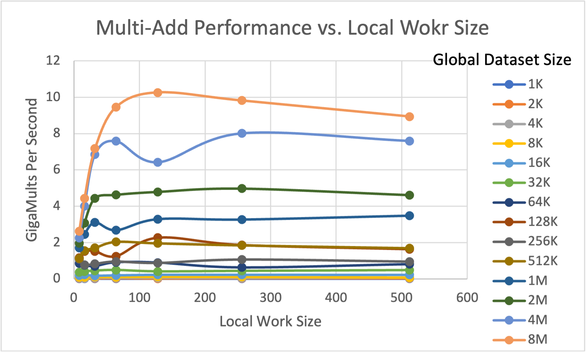
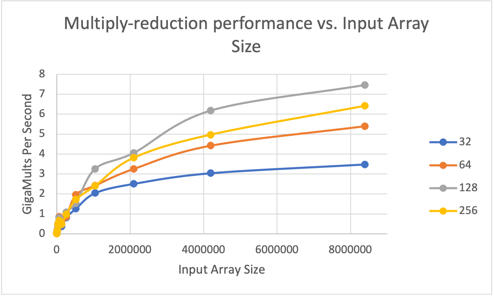

# Part 1: Array Multiply and Array Multiply-Add
## 1. What machine you ran this on?

I ran this program on rabbit.

## 2. Show the tables and graphs.

This section will be divided into tables and graphs.

### Tables

The first table is a pivot table of Multiply performance. The row header is local work size and the column header is global dataset size.

| | 8     | 16    | 32    | 64     | 128    | 256    | 512    |
| :------ | :---- | :---- | :---- | :----- | :----- | :----- | :----- |
| 1024    | 0.012 | 0.012 | 0.013 | 0.01   | 0.01   | 0.012  | 0.012  |
| 2048    | 0.027 | 0.026 | 0.03  | 0.023  | 0.027  | 0.027  | 0.029  |
| 4096    | 0.048 | 0.066 | 0.038 | 0.047  | 0.055  | 0.047  | 0.059  |
| 8192    | 0.119 | 0.121 | 0.106 | 0.094  | 0.112  | 0.091  | 0.097  |
| 16384   | 0.135 | 0.182 | 0.225 | 0.181  | 0.224  | 0.173  | 0.245  |
| 32768   | 0.358 | 0.444 | 0.33  | 0.359  | 0.345  | 0.328  | 0.384  |
| 65536   | 0.733 | 0.808 | 0.913 | 0.943  | 0.878  | 0.924  | 0.871  |
| 131072  | 0.45  | 0.406 | 0.558 | 0.538  | 0.483  | 0.394  | 0.434  |
| 262144  | 0.901 | 0.873 | 0.802 | 1.043  | 1.053  | 0.833  | 1.122  |
| 524288  | 1.31  | 1.594 | 1.766 | 1.993  | 1.746  | 1.698  | 2.005  |
| 1048576 | 2.006 | 2.599 | 3.26  | 3.067  | 3.18   | 3.201  | 3.454  |
| 2097152 | 2.109 | 3.802 | 5.152 | 4.796  | 5.07   | 5.142  | 5.419  |
| 4194304 | 2.531 | 3.776 | 5.925 | 7.116  | 9.374  | 7.652  | 7.456  |
| 8388608 | 2.809 | 4.76  | 7.883 | 11.656 | 14.011 | 11.137 | 10.051 |

Table: Multiply Pivot Table

The second table is a pivot table of Multiply-Add performance. The row header is local work size and the column header is global dataset size.

|  | 8     | 16    | 32    | 64    | 128    | 256   | 512   |
| :------ | :---- | :---- | :---- | :---- | :----- | :---- | :---- |
| 1024    | 0.011 | 0.014 | 0.019 | 0.01  | 0.013  | 0.016 | 0.013 |
| 2048    | 0.029 | 0.024 | 0.025 | 0.038 | 0.022  | 0.036 | 0.031 |
| 4096    | 0.053 | 0.036 | 0.061 | 0.055 | 0.054  | 0.048 | 0.058 |
| 8192    | 0.1   | 0.097 | 0.104 | 0.101 | 0.114  | 0.103 | 0.066 |
| 16384   | 0.182 | 0.221 | 0.175 | 0.195 | 0.224  | 0.226 | 0.22  |
| 32768   | 0.36  | 0.406 | 0.452 | 0.487 | 0.412  | 0.436 | 0.48  |
| 65536   | 0.85  | 0.755 | 0.704 | 0.914 | 0.897  | 0.63  | 0.809 |
| 131072  | 1.156 | 1.517 | 1.522 | 1.248 | 2.268  | 1.865 | 1.635 |
| 262144  | 1.078 | 0.783 | 0.831 | 0.953 | 0.879  | 1.059 | 0.95  |
| 524288  | 1.117 | 1.552 | 1.705 | 2.043 | 1.96   | 1.847 | 1.689 |
| 1048576 | 1.712 | 2.439 | 3.107 | 2.678 | 3.285  | 3.262 | 3.474 |
| 2097152 | 1.963 | 3.079 | 4.439 | 4.628 | 4.789  | 4.969 | 4.612 |
| 4194304 | 2.254 | 4.011 | 6.849 | 7.583 | 6.417  | 8.011 | 7.592 |
| 8388608 | 2.63  | 4.426 | 7.168 | 9.45  | 10.261 | 9.816 | 8.937 |

Table: Multiply-Add Pivot Table

### Graphs

## 3. What patterns are you seeing in the performance curves?

For a given global dataset size, the performances of both multiply and multiply-add increase when the local work size increase and the performances reaches the highest when local work size equals to 128 for most global dataset size.

And for a given local work size, the performances of both multiply and multiply-add have a trend of increasing with the global dataset size increasing. 

## 4. Why do you think the patterns look this way?

When the local work size is small (like 8 to 16), there are more processing elements in the compute units are idle and a lot of compute time are wasted.

When the global dataset size is too small, the GPU is not so busy and not enough work done on GPU can’t overcome the overhead of setting all up.

## 5. What is the performance difference between doing a Multiply and doing a Multiply-Add?

The trends of performances are similar between doing a Multiply and doing a Multiply-Add. However, for a given local work size and global dataset size, the greatest performance of Multiply is better than performance of Multiply-Add. Because the kernel of Multiply-Add is more complicated than Multiply, the processing time of doing Multiply-Add on GPU is longer than doing Multiply.

## 6. What does that mean for the proper use of GPU parallel computing?

It is proper to choose a local work size of at least 32 or multiple of 32, because it is a simple kernel of 32 and we can keep the GPU more busy than small local work size. And according to figures above, it seems that 128 is the best choice.

And, if the data size is too small, it is not worth to do it on GPU. Only when the data size is big enough, the GPU parallel computing can overcome the overhead of setting up.

\pagebreak

# Part 2: Array Multiply-Reduction
## 1. Show this table and graph

|         | 32    | 64    | 128   | 256   |
| :------ | :---- | :---- | :---- | :---- |
| 1024    | 0.009 | 0.015 | 0.012 | 0.012 |
| 2048    | 0.034 | 0.025 | 0.016 | 0.022 |
| 4096    | 0.048 | 0.059 | 0.047 | 0.052 |
| 8192    | 0.089 | 0.118 | 0.147 | 0.125 |
| 16384   | 0.174 | 0.174 | 0.216 | 0.181 |
| 32768   | 0.409 | 0.416 | 0.509 | 0.472 |
| 65536   | 0.687 | 0.859 | 0.811 | 0.664 |
| 131072  | 0.37  | 0.457 | 0.469 | 0.496 |
| 262144  | 0.812 | 0.861 | 1.086 | 0.978 |
| 524288  | 1.265 | 1.961 | 1.535 | 1.727 |
| 1048576 | 2.045 | 2.425 | 3.262 | 2.411 |
| 2097152 | 2.507 | 3.255 | 4.054 | 3.813 |
| 4194304 | 3.043 | 4.423 | 6.176 | 4.971 |
| 8388608 | 3.485 | 5.398 | 7.455 | 6.415 |

Table: Multiply-Reduction Pivot Table

## 2. What pattern are you seeing in this performance curve?

For a given local work size, the performance increases as the array size increases. And for a given input array size, the Multiply-Reduction performance increases as the local work size increase and it will reach the top at 128 local work size. 

## 3. Why do you think the pattern looks this way?

When the array size is small, which is smaller than $1\ M$, the GPU is not so busy and the overhead may cost too much time. And it will have a better performance when local work size increases to 128, as it is closer to the biggest size that we can keep the GPU as busiest. 

## 4. What does that mean for the proper use of GPU parallel computing?

Similar as what we stated before in Part 1, it is proper to choose 128 local work size. And if the data size is too small, it is not worth to do it on GPU. Only when the data size is big enough, the GPU parallel computing can overcome the overhead of setting up.