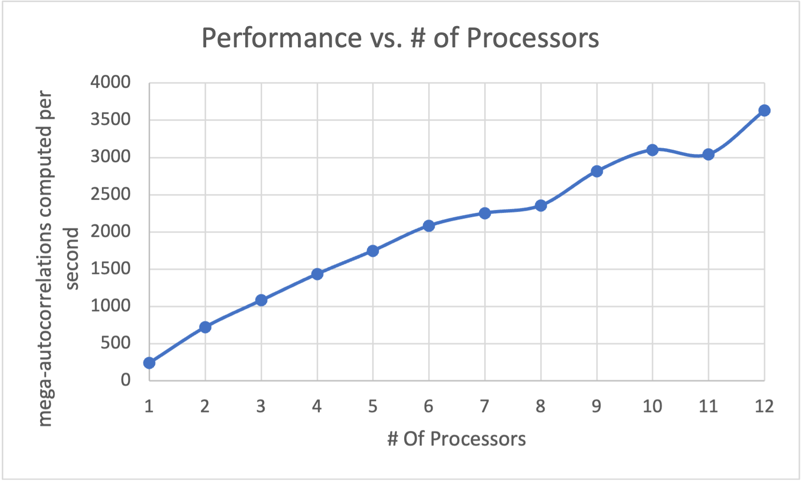

# 1. Show the Sums[1] ... Sums[255] vs. shift scatterplot.

![Sums[*] vs. Shift](Picture2.png)

# 2. State what the secret sine-wave period is, i.e., what change in shift gets you one complete sine wave?

The secret sine-wave period is about 105.

# 3. Show your graph of Performance vs. Number of Processors used.

# 4. What patterns are you seeing in the performance graph?

The performance has a trend of increasing with the growing of number of processors. And the line is nearly a linear trend.

# 5. Why do you think the performances work this way?

Because except for data I/O (sending, receiving), the computing part is partitioned equally to different processes, and they have no inter-communications. So their running time should be roughly the same. Therefore, the program can be scaled up nearly linearly. 